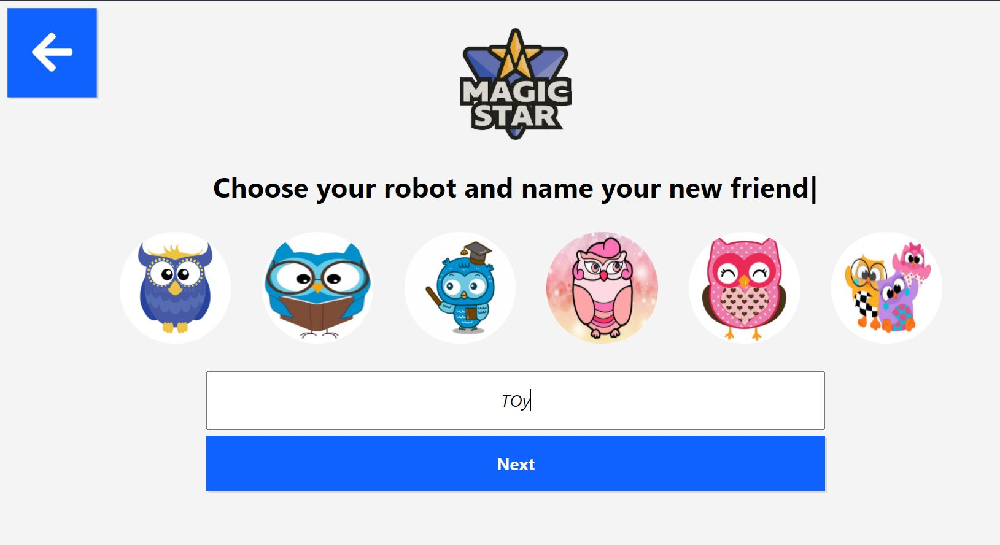
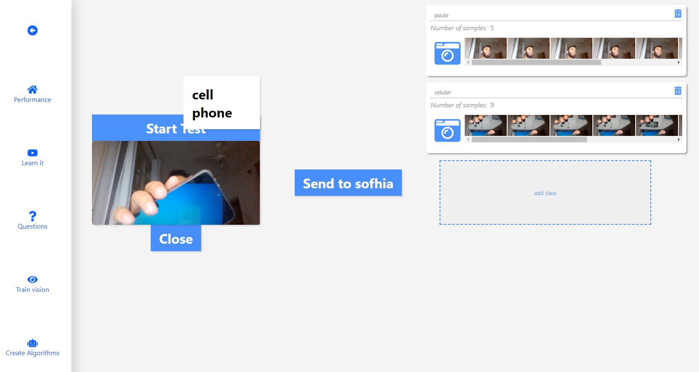
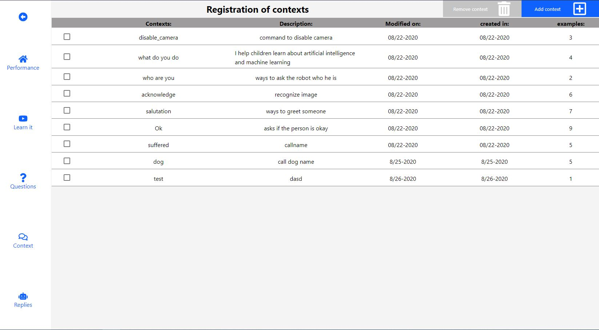

this project was make with react.js [Create React App](https://github.com/facebook/create-react-app).
  

    
     
  
  

  
  
<!-- ABOUT THE PROJECT -->
  
## starting project

In the project directory, you can run:

### `yarn`

this will be install necessary packages on the project. 

### `yarn dash` 

This script start the application 

## Was Used on this project 

* [Styled-Components](https://styled-components.com/)
* [Axios](https://github.com/axios/axios)
* [React](https://react.dev/)

## This application need backend project on the robot-back project 

https://github.com/paulohenry/robot-back

## to connect backend to frontend, follow instructions on the repo above.
